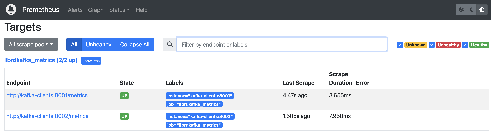
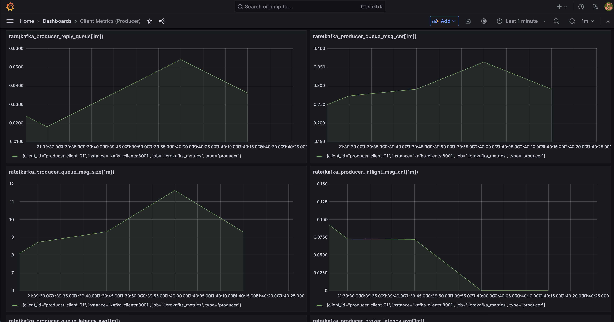

# librdkafka-metrics
Kafka client metrics with librdkafka integrated with Prometheus and Grafana (based on https://github.com/shakti-garg/prometheus_kafka_metrics).


## What it is about
In Apache Kafka, Java clients such as producers and consumers expose metrics via Java Management Extensions (JMX). JMX is a robust and standardized way to manage and monitor Java applications. It provides a wide range of performance and resource utilization metrics, enabling administrators to gain insights into the behavior and performance of Kafka clients. These metrics include details on message throughput, latency, connection counts, and other critical performance indicators. By leveraging JMX, users can integrate Kafka client metrics with various monitoring tools and dashboards, facilitating proactive management and troubleshooting of Kafka-based systems.

On the other hand, non-Java Kafka clients, such as those based on [librdkafka](https://github.com/confluentinc/librdkafka) (commonly used in languages like Python, C, and Go), do not support JMX for metrics exposition. Instead, librdkafka can be configured to emit [internal metrics](https://github.com/confluentinc/librdkafka/blob/master/STATISTICS.md) at regular intervals. This is achieved by setting the `statistics.interval.ms` configuration property to a value greater than zero, which determines the interval (in milliseconds) at which metrics are collected and emitted. Additionally, a stats callback function (`stats_cb`) must be registered to handle these metrics. The metrics provided by librdkafka cover similar performance and resource usage areas as JMX metrics, including message production and consumption rates, latency, and broker connectivity. However, the key difference lies in the implementation and integration approach, with librdkafka relying on language-specific mechanisms to handle and process these metrics rather than the standardized JMX framework. This requires additional setup to integrate these metrics into monitoring systems, but it provides flexibility for non-Java clients to achieve comprehensive observability.

This demo uses the [Confluent Kafka library](https://github.com/confluentinc/confluent-kafka-python) and [Confluent Platform](https://www.confluent.io/en-gb/product/confluent-platform/), where the librdkafka metrics are enabled for both a Kafka producer and a consumer. These metrics provide valuable insights into the performance and health of the Kafka clients, including message throughput, latency, and broker connection status. To facilitate monitoring, each client exposes an HTTP REST interface, making these metrics easily accessible. Tools like Prometheus can scrape this data from the REST endpoints at regular intervals, allowing seamless integration with Grafana for real-time visualization and analysis. This setup not only enhances observability but also enables proactive monitoring and quick troubleshooting of Kafka client operations.

## Requirements
- [Python 3.8+](https://www.python.org/)
- [Docker Desktop](https://www.docker.com/products/docker-desktop/)

## How to enable librdkafka metrics
To enable librdkafka metrics, two additional client configurations are required. See the last two parameters in the example below:
```Python
consumer_config = {
    "bootstrap.servers": ...
    "group.id": ...,
    "client.id": ...,
    "auto.offset.reset": ...,
    ...
    # Set librdkafka metric
    "statistics.interval.ms": 5000,        # interval in milliseconds
    "stats_cb": <callback_function_here>,  # stats callback function
}
```

Upon starting the Kafka client, the metrics will be automatically provided as a JSON string. For example, by setting the callback function parameter as `"stats_cb": my_callback` and defining the callback function as:
```Python
def my_callback(stats_json_str):
    print(stats_json_str)
```

After 5 seconds (as specified by `"statistics.interval.ms": 5000`), the console output would be an example of the metrics JSON string:
```JSON
{ "name": "producer-client-01#producer-1", "client_id": "producer-client-01", "type": "producer", "ts":2812489068, "time":1719523102, "age":5001666, "replyq":1, "msg_cnt":4, "msg_size":128, "msg_max":100000, "msg_size_max":1073741824, "simple_cnt":0, "metadata_cache_cnt":1, "brokers":{ "broker:9094/1": { "name":"broker:9094/1", "nodeid":1, "nodename":"broker:9094", "source":"configured", "state":"UP", "stateage":4994779, "outbuf_cnt":0, "outbuf_msg_cnt":0, "waitresp_cnt":0, "waitresp_msg_cnt":0, "tx":591, "txbytes":200508, "txerrs":0, "txretries":0, "txidle":724, "req_timeouts":0, "rx":591, "rxbytes":41483, "rxerrs":0, "rxcorriderrs":0, "rxpartial":0, "rxidle":393, "zbuf_grow":0, "buf_grow":0, "wakeups":2330, "connects":1, "disconnects":0, "int_latency": { "min":5, "max":1002102, "avg":104039, "sum":261243741, "stddev": 12929, "p50": 3871, "p75": 5855, "p90": 6111, "p95": 6271, "p99": 88063, "p99_99": 130047, "outofrange": 441, "hdrsize": 11376, "cnt":2511 }, "outbuf_latency": { "min":8, "max":146, "avg":26, "sum":15418, "stddev": 14, "p50": 22, "p75": 30, "p90": 41, "p95": 54, "p99": 92, "p99_99": 146, "outofrange": 0, "hdrsize": 11376, "cnt":591 }, "rtt": { "min":166, "max":5448, "avg":447, "sum":264313, "stddev": 461, "p50": 337, "p75": 461, "p90": 619, "p95": 843, "p99": 2319, "p99_99": 5471, "outofrange": 0, "hdrsize": 13424, "cnt":591 }, "throttle": { "min":0, "max":0, "avg":0, "sum":0, "stddev": 0, "p50": 0, "p75": 0, "p90": 0, "p95": 0, "p99": 0, "p99_99": 0, "outofrange": 0, "hdrsize": 17520, "cnt":0 }, "req": { "Produce": 588, "ListOffsets": 0, "Metadata": 2, "FindCoordinator": 0, "SaslHandshake": 0, "ApiVersion": 1, "InitProducerId": 0, "AddPartitionsToTxn": 0, "AddOffsetsToTxn": 0, "EndTxn": 0, "TxnOffsetCommit": 0, "SaslAuthenticate": 0, "DescribeCluster": 0, "DescribeProducers": 0, "Unknown-62?": 0, "DescribeTransactions": 0, "ListTransactions": 0 }, "toppars":{ "demo_data_1-0": { "topic":"demo_data_1", "partition":0} } } }, "topics":{ "demo_data_1": { "topic":"demo_data_1", "age":5001, "metadata_age":3999, "batchsize": { "min":110, "max":17253, "avg":271, "sum":159727, "stddev": 779, "p50": 208, "p75": 257, "p90": 257, "p95": 257, "p99": 257, "p99_99": 17279, "outofrange": 0, "hdrsize": 14448, "cnt":588 }, "batchcnt": { "min":1, "max":339, "avg":4, "sum":2511, "stddev": 15, "p50": 3, "p75": 4, "p90": 4, "p95": 4, "p99": 4, "p99_99": 339, "outofrange": 0, "hdrsize": 8304, "cnt":588 }, "partitions":{ "0": { "partition":0, "broker":1, "leader":1, "desired":false, "unknown":false, "msgq_cnt":0, "msgq_bytes":0, "xmit_msgq_cnt":0, "xmit_msgq_bytes":0, "fetchq_cnt":0, "fetchq_size":0, "fetch_state":"none", "query_offset":-1001, "next_offset":0, "app_offset":-1001, "stored_offset":-1001, "stored_leader_epoch":-1, "commited_offset":-1001, "committed_offset":-1001, "committed_leader_epoch":-1, "eof_offset":-1001, "lo_offset":-1001, "hi_offset":-1001, "ls_offset":-1001, "consumer_lag":-1, "consumer_lag_stored":-1, "leader_epoch":0, "txmsgs":2511, "txbytes":105462, "rxmsgs":0, "rxbytes":0, "msgs": 2512, "rx_ver_drops": 0, "msgs_inflight": 0, "next_ack_seq": 0, "next_err_seq": 0, "acked_msgid": 0} , "-1": { "partition":-1, "broker":-1, "leader":-1, "desired":false, "unknown":false, "msgq_cnt":0, "msgq_bytes":0, "xmit_msgq_cnt":0, "xmit_msgq_bytes":0, "fetchq_cnt":0, "fetchq_size":0, "fetch_state":"none", "query_offset":-1001, "next_offset":0, "app_offset":-1001, "stored_offset":-1001, "stored_leader_epoch":-1, "commited_offset":-1001, "committed_offset":-1001, "committed_leader_epoch":-1, "eof_offset":-1001, "lo_offset":-1001, "hi_offset":-1001, "ls_offset":-1001, "consumer_lag":-1, "consumer_lag_stored":-1, "leader_epoch":-1, "txmsgs":0, "txbytes":0, "rxmsgs":0, "rxbytes":0, "msgs": 507, "rx_ver_drops": 0, "msgs_inflight": 0, "next_ack_seq": 0, "next_err_seq": 0, "acked_msgid": 0} } } } , "tx":591, "tx_bytes":200508, "rx":591, "rx_bytes":41483, "txmsgs":2511, "txmsg_bytes":105462, "rxmsgs":0, "rxmsg_bytes":0}
```

The [producer](https://github.com/ifnesi/librdkafka-metrics/blob/main/src/kafka_producer.py) and [consumer](https://github.com/ifnesi/librdkafka-metrics/blob/main/src/kafka_consumer.py) in this demo parse the metrics JSON string, convert them to the format expected by a Prometheus exporter (using the [Prometheus instrumentation library for confluent-kafka-python applications](https://pypi.org/project/prometheus-kafka-metrics/) Python lib), and then exposes it via an HTTP REST API.

### Producer Metrics (http://localhost:8001/metrics)
```
# HELP python_gc_objects_collected_total Objects collected during gc
# TYPE python_gc_objects_collected_total counter
python_gc_objects_collected_total{generation="0"} 379.0
python_gc_objects_collected_total{generation="1"} 7.0
python_gc_objects_collected_total{generation="2"} 0.0
# HELP python_gc_objects_uncollectable_total Uncollectable objects found during GC
# TYPE python_gc_objects_uncollectable_total counter
python_gc_objects_uncollectable_total{generation="0"} 0.0
python_gc_objects_uncollectable_total{generation="1"} 0.0
python_gc_objects_uncollectable_total{generation="2"} 0.0
# HELP python_gc_collections_total Number of times this generation was collected
# TYPE python_gc_collections_total counter
python_gc_collections_total{generation="0"} 44.0
python_gc_collections_total{generation="1"} 4.0
python_gc_collections_total{generation="2"} 0.0
# HELP python_info Python platform information
# TYPE python_info gauge
python_info{implementation="CPython",major="3",minor="8",patchlevel="17",version="3.8.17"} 1.0
# HELP process_virtual_memory_bytes Virtual memory size in bytes.
# TYPE process_virtual_memory_bytes gauge
process_virtual_memory_bytes 4.87591936e+08
# HELP process_resident_memory_bytes Resident memory size in bytes.
# TYPE process_resident_memory_bytes gauge
process_resident_memory_bytes 2.9392896e+07
# HELP process_start_time_seconds Start time of the process since unix epoch in seconds.
# TYPE process_start_time_seconds gauge
process_start_time_seconds 1.71951240696e+09
# HELP process_cpu_seconds_total Total user and system CPU time spent in seconds.
# TYPE process_cpu_seconds_total counter
process_cpu_seconds_total 96.09
# HELP process_open_fds Number of open file descriptors.
# TYPE process_open_fds gauge
process_open_fds 12.0
# HELP process_max_fds Maximum number of open file descriptors.
# TYPE process_max_fds gauge
process_max_fds 1.048576e+06
# HELP kafka_consumer_reply_queue Number of ops(callbacks, events, etc) waiting in queue to serve with poll
# TYPE kafka_consumer_reply_queue gauge
# HELP kafka_consumer_consumed_records_rate Average number of messages consumed (excluding ignored msgs) per second
# TYPE kafka_consumer_consumed_records_rate gauge
# HELP kafka_consumer_consumed_bytes_rate Average message bytes (including framing) consumed per second
# TYPE kafka_consumer_consumed_bytes_rate gauge
# HELP kafka_consumer_records_lag Number of messages consumer is behind producer on this partition
# TYPE kafka_consumer_records_lag gauge
# HELP kafka_producer_reply_queue Number of ops(callbacks, events, etc) waiting in queue to serve with poll
# TYPE kafka_producer_reply_queue gauge
kafka_producer_reply_queue{client_id="generic-avro-producer-01",type="producer"} 0.0
# HELP kafka_producer_queue_msg_cnt Current number of messages in prometheus_kafka_producer queues
# TYPE kafka_producer_queue_msg_cnt gauge
kafka_producer_queue_msg_cnt{client_id="generic-avro-producer-01",type="producer"} 2.0
# HELP kafka_producer_queue_msg_size Current total size of messages in prometheus_kafka_producer queues
# TYPE kafka_producer_queue_msg_size gauge
kafka_producer_queue_msg_size{client_id="generic-avro-producer-01",type="producer"} 64.0
# HELP kafka_producer_inflight_msg_cnt Number of messages in-flight to broker awaiting response
# TYPE kafka_producer_inflight_msg_cnt gauge
kafka_producer_inflight_msg_cnt{client_id="generic-avro-producer-01",type="producer"} 0.0
# HELP kafka_producer_queue_latency_avg Average Producer queue latency in milliseconds
# TYPE kafka_producer_queue_latency_avg gauge
kafka_producer_queue_latency_avg{client_id="generic-avro-producer-01",type="producer"} 3.5695178971820836
# HELP kafka_producer_broker_latency_avg Broker latency / round-trip time in milliseconds
# TYPE kafka_producer_broker_latency_avg gauge
kafka_producer_broker_latency_avg{client_id="generic-avro-producer-01",type="producer"} 0.8914092953523238
# HELP kafka_producer_batch_size_bytes_avg Average Batch sizes in bytes
# TYPE kafka_producer_batch_size_bytes_avg gauge
kafka_producer_batch_size_bytes_avg{client_id="generic-avro-producer-01",type="producer"} 234.15292353823088
# HELP kafka_producer_batch_size_avg Average Batch message counts
# TYPE kafka_producer_batch_size_avg gauge
kafka_producer_batch_size_avg{client_id="generic-avro-producer-01",type="producer"} 3.5337331334332833
# HELP kafka_producer_request_rate Average number of requests sent per second
# TYPE kafka_producer_request_rate gauge
kafka_producer_request_rate{client_id="generic-avro-producer-01",type="producer"} 125331.41994980247
# HELP kafka_producer_request_bytes_rate Average number of requests bytes sent per second
# TYPE kafka_producer_request_bytes_rate gauge
kafka_producer_request_bytes_rate{client_id="generic-avro-producer-01",type="producer"} 40952.609784121814
# HELP kafka_producer_response_rate Average number of responses received per second
# TYPE kafka_producer_response_rate gauge
kafka_producer_response_rate{client_id="generic-avro-producer-01",type="producer"} 133.32970857763786
# HELP kafka_producer_response_bytes_rate Average number of response bytes received per second
# TYPE kafka_producer_response_bytes_rate gauge
kafka_producer_response_bytes_rate{client_id="generic-avro-producer-01",type="producer"} 0.0
```

### Consumer Metrics (http://localhost:8002/metrics)
```
# HELP python_gc_objects_collected_total Objects collected during gc
# TYPE python_gc_objects_collected_total counter
python_gc_objects_collected_total{generation="0"} 130.0
python_gc_objects_collected_total{generation="1"} 28.0
python_gc_objects_collected_total{generation="2"} 0.0
# HELP python_gc_objects_uncollectable_total Uncollectable objects found during GC
# TYPE python_gc_objects_uncollectable_total counter
python_gc_objects_uncollectable_total{generation="0"} 0.0
python_gc_objects_uncollectable_total{generation="1"} 0.0
python_gc_objects_uncollectable_total{generation="2"} 0.0
# HELP python_gc_collections_total Number of times this generation was collected
# TYPE python_gc_collections_total counter
python_gc_collections_total{generation="0"} 44.0
python_gc_collections_total{generation="1"} 4.0
python_gc_collections_total{generation="2"} 0.0
# HELP python_info Python platform information
# TYPE python_info gauge
python_info{implementation="CPython",major="3",minor="8",patchlevel="17",version="3.8.17"} 1.0
# HELP process_virtual_memory_bytes Virtual memory size in bytes.
# TYPE process_virtual_memory_bytes gauge
process_virtual_memory_bytes 5.62794496e+08
# HELP process_resident_memory_bytes Resident memory size in bytes.
# TYPE process_resident_memory_bytes gauge
process_resident_memory_bytes 2.8454912e+07
# HELP process_start_time_seconds Start time of the process since unix epoch in seconds.
# TYPE process_start_time_seconds gauge
process_start_time_seconds 1.71951238744e+09
# HELP process_cpu_seconds_total Total user and system CPU time spent in seconds.
# TYPE process_cpu_seconds_total counter
process_cpu_seconds_total 107.96000000000001
# HELP process_open_fds Number of open file descriptors.
# TYPE process_open_fds gauge
process_open_fds 15.0
# HELP process_max_fds Maximum number of open file descriptors.
# TYPE process_max_fds gauge
process_max_fds 1.048576e+06
# HELP kafka_consumer_reply_queue Number of ops(callbacks, events, etc) waiting in queue to serve with poll
# TYPE kafka_consumer_reply_queue gauge
kafka_consumer_reply_queue{client_id="avro-deserialiser-01",type="consumer"} 0.0
# HELP kafka_consumer_consumed_records_rate Average number of messages consumed (excluding ignored msgs) per second
# TYPE kafka_consumer_consumed_records_rate gauge
kafka_consumer_consumed_records_rate{client_id="avro-deserialiser-01",partition="0",topic="demo_data",type="consumer"} 458.01770895183716
kafka_consumer_consumed_records_rate{client_id="avro-deserialiser-01",partition="-1",topic="demo_data",type="consumer"} 0.0
# HELP kafka_consumer_consumed_bytes_rate Average message bytes (including framing) consumed per second
# TYPE kafka_consumer_consumed_bytes_rate gauge
kafka_consumer_consumed_bytes_rate{client_id="avro-deserialiser-01",partition="0",topic="demo_data",type="consumer"} 19236.74377597716
kafka_consumer_consumed_bytes_rate{client_id="avro-deserialiser-01",partition="-1",topic="demo_data",type="consumer"} 0.0
# HELP kafka_consumer_records_lag Number of messages consumer is behind producer on this partition
# TYPE kafka_consumer_records_lag gauge
kafka_consumer_records_lag{client_id="avro-deserialiser-01",partition="0",topic="demo_data",type="consumer"} 46.0
kafka_consumer_records_lag{client_id="avro-deserialiser-01",partition="-1",topic="demo_data",type="consumer"} -1.0
# HELP kafka_producer_reply_queue Number of ops(callbacks, events, etc) waiting in queue to serve with poll
# TYPE kafka_producer_reply_queue gauge
# HELP kafka_producer_queue_msg_cnt Current number of messages in prometheus_kafka_producer queues
# TYPE kafka_producer_queue_msg_cnt gauge
# HELP kafka_producer_queue_msg_size Current total size of messages in prometheus_kafka_producer queues
# TYPE kafka_producer_queue_msg_size gauge
# HELP kafka_producer_inflight_msg_cnt Number of messages in-flight to broker awaiting response
# TYPE kafka_producer_inflight_msg_cnt gauge
# HELP kafka_producer_queue_latency_avg Average Producer queue latency in milliseconds
# TYPE kafka_producer_queue_latency_avg gauge
# HELP kafka_producer_broker_latency_avg Broker latency / round-trip time in milliseconds
# TYPE kafka_producer_broker_latency_avg gauge
# HELP kafka_producer_batch_size_bytes_avg Average Batch sizes in bytes
# TYPE kafka_producer_batch_size_bytes_avg gauge
# HELP kafka_producer_batch_size_avg Average Batch message counts
# TYPE kafka_producer_batch_size_avg gauge
# HELP kafka_producer_request_rate Average number of requests sent per second
# TYPE kafka_producer_request_rate gauge
# HELP kafka_producer_request_bytes_rate Average number of requests bytes sent per second
# TYPE kafka_producer_request_bytes_rate gauge
# HELP kafka_producer_response_rate Average number of responses received per second
# TYPE kafka_producer_response_rate gauge
# HELP kafka_producer_response_bytes_rate Average number of response bytes received per second
# TYPE kafka_producer_response_bytes_rate gauge
```

## Running the demo
Before running the demo for the first time, please execute the following steps:
- Clone this repo: `git clone git@github.com:ifnesi/librdkafka-metrics.git`
- Go to the demo folder: `cd librdkafka-metrics`

All demo configuration are set via environment variables (please refer to the file `.env` for details).

To start the demo, please run `./start_demo.sh`, after downloading all docker images it should take less than 2 minutes to have everything up and running.

Once the start script is completed it will open the following browser tabs:
- Confluent Control Center: http://localhost:9021/clusters
- Prometheus Status: http://localhost:9090/targets?search=
- Grafana: http://localhost:3000 (username: `admin`, password: `password`)

### Confluent Control Center


### Prometheus Status


### Grafana Producer Dashboard


### Grafana Consumer Dashboard


# External References
- [librdkafka Statistics](https://github.com/confluentinc/librdkafka/blob/master/STATISTICS.md)
- [Prometheus instrumentation library for confluent-kafka-python applications](https://pypi.org/project/prometheus-kafka-metrics/)
- [Original GitHub repo that inspired me to write this demo](https://github.com/shakti-garg/prometheus_kafka_metrics)
- [Confluent Platform](https://www.confluent.io/en-gb/product/confluent-platform/)
- [Confluent Control Center](https://docs.confluent.io/platform/current/control-center/index.html)
- [confluent_kafka](https://docs.confluent.io/platform/current/clients/confluent-kafka-python/html/index.html) Python library (based on [librdkafka](https://github.com/confluentinc/librdkafka))

Check out [Confluent's Developer portal](https://developer.confluent.io), it has free courses, documents, articles, blogs, podcasts and so many more content to get you up and running with a fully managed Apache Kafka service.

Disclaimer: I work for Confluent :wink: